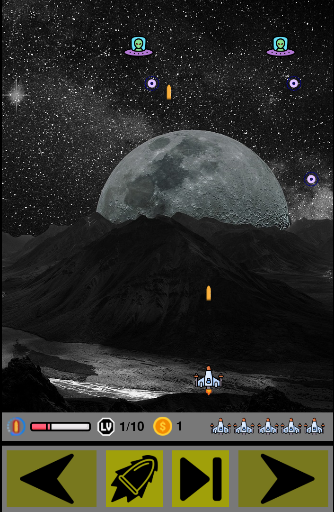
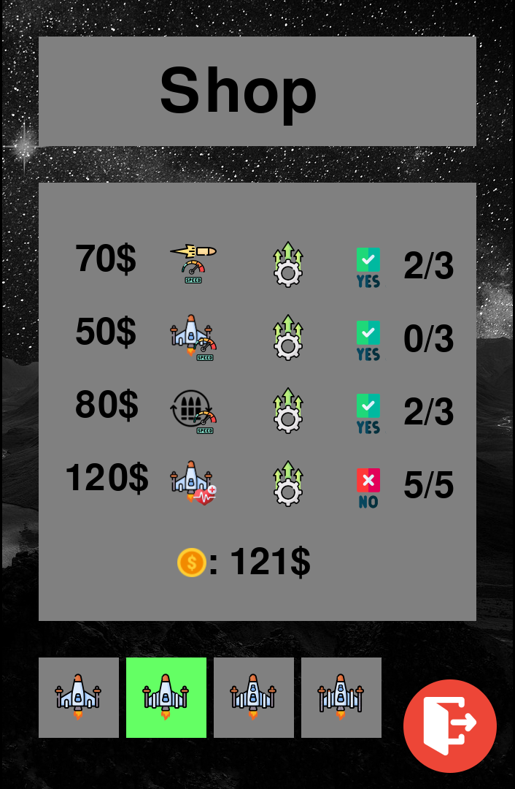
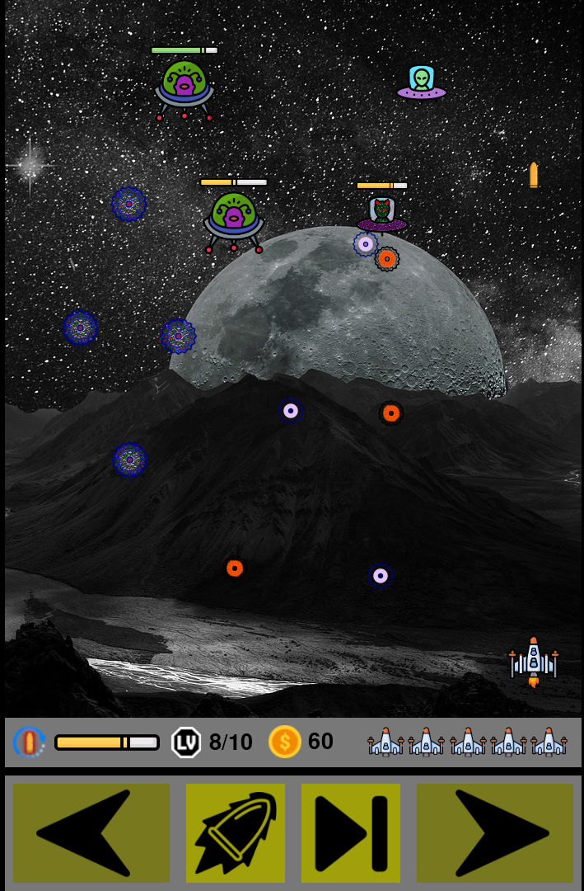
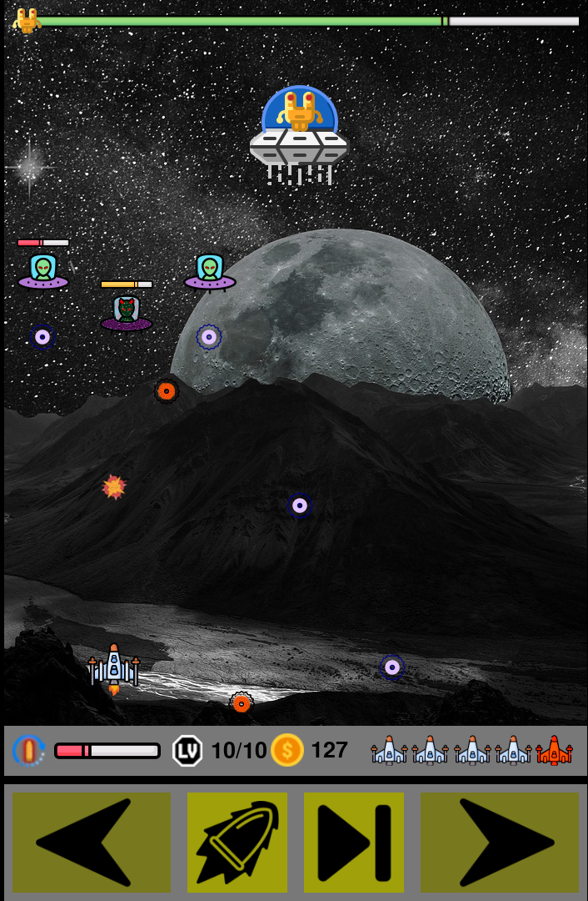

# SpaceInvaders
Computer game based on the popular space invaders game

## Table of Contents
* [General info](#general-info)
* [Technologies Used](#technologies-used)
* [Setup](#setup)
* [Screenshots](#screenschots)
* [Project Status](#project-status)
* [Sources](#sources)

## General info
I created a 2D game in Python, based on the classic Space Invaders. Thanks to this, I developed my skills in object-oriented programming and working with graphics and animations.

## Technologies Used
Project is created with:
* Python version: 3.10
* Pygame version: 2.6.1
* PyCharm Comunity Edition
* Gimp

## Setup
To run this project, create new empty project in PyCharm editor, copy all files and put command below in PyCharm terminal:
```
pip install -r .\requirements.txt
```

## Screenshots
Sample screenshots from the game:









## Project Status
Project is complete. I currently have no plans to further develop the game, as I have achieved the intended learning outcomes

## Sources
Game was based on the popular classic game of the same title
